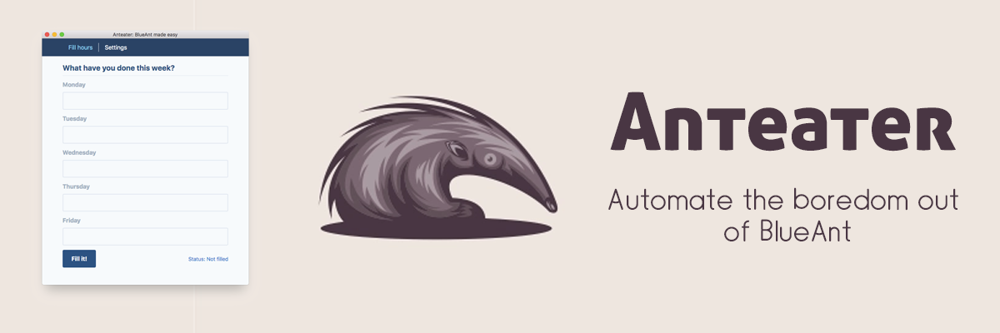

# Anteater

Automate the boredom out of BlueAnt.

## Description

This project aims to automate cumbersome and boring manual steps that are required to be executed in BlueAnt for reporting hours.

In this initial stage, it **enables a user to upload the descriptions of the entire week** on a single page.

Other future functionality can be found on the [issues page](https://github.com/fsschmitt/anteater/issues).

___

## Tech Stack

Currently anteater is built using `react` for the UI, with `tailwindcss` as the css library. `parcel` is used to compile the code that is then shipped into an `electron` app. `electron-forge` is used to help with the app packaging and distribution in multiple formats.

To build targeting `MacOS` you need a `MacOS` machine, the same happens with targeting `Debian` and `RedHat`, `electron-forge` supports that out of the box.

## How to develop

Install

`npm install`

NPM commands

- `dev` - serves react app and initiates the electron application - please keep in mind that any changes to the electron code need this to be restarted, ui code auto refreshes

- `make` - generates the runnable and installable package at the `./out` folder

## How to release

After a feature branch is merged into `master`, one should go into this main branch and run `npm run release`.

Everything will be handled, changelogs will be created based on `convetionalcommits` and a git tag will also be created, after that its just a matter of `git push` and everything should be ok.

In order to get the distributable package, `npm run make` should be run and the package distributed at your own means.
